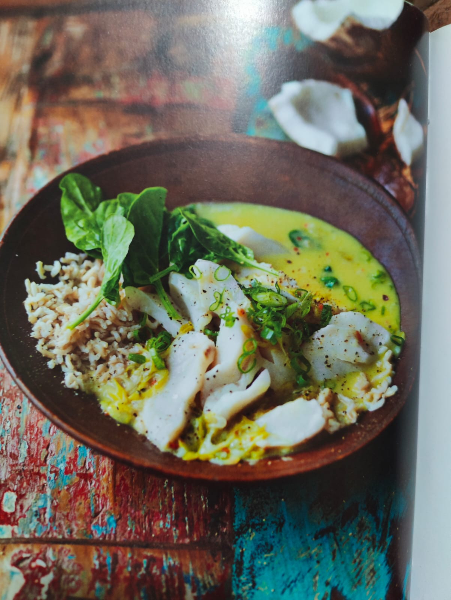

For Renée's birthday party, **Nana (Nancy) and Dad** are bringing the warmth of the Caribbean to the table with **Caribbean Fish Curry with Spinach & Coconut** from _Ainsley's Caribbean Kitchen_.

This one-pot wonder combines tender white fish, creamy coconut milk, fresh spinach, and a medley of spices for a comforting yet flavorful dish that’s perfect for a festive gathering.

### What to Expect

- **Key Flavors:** Aromatic Caribbean curry spices, rich coconut, and fresh herbs.
- **Perfect Pairing:** Serve with rice or rice 'n' peas, topped with fresh coriander for a complete, hearty meal.
- **Difficulty Level:** Easy—perfect for those who love a flavorful, fuss-free dish!

Nana and Dad are excited to share this flavorful and aromatic curry with everyone. It’s sure to be a crowd-pleaser!
