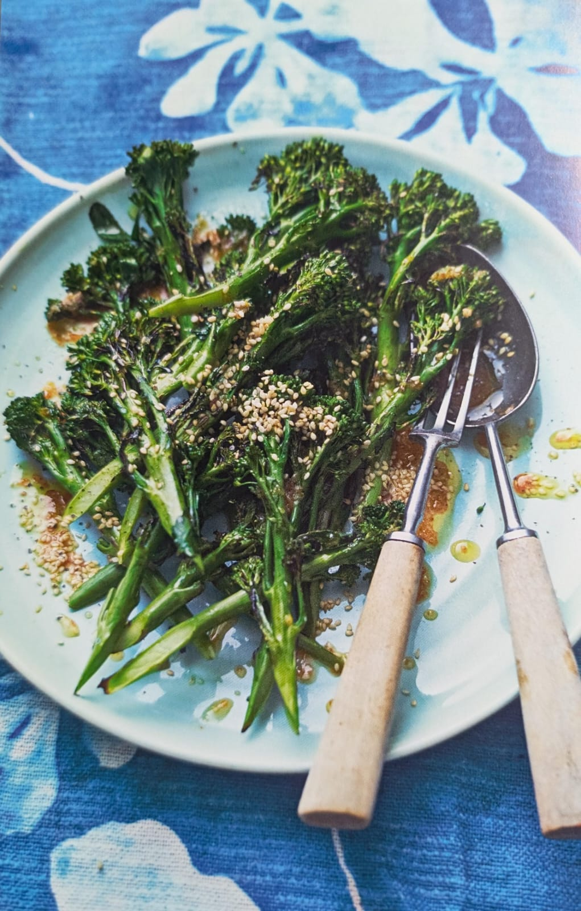

For Renee's birthday party, **Gabbie** is bringing a flavorful side dish: **Charred Broccoli with Hot Pepper Sauce & Citrus Salt** from _Ainsley's Caribbean Kitchen_.

This vibrant dish combines tender charred broccoli with a zesty dressing made from hot pepper sauce, garlic, honey, and lemon. It's topped with toasted sesame seeds and a sprinkle of citrus salt for the perfect balance of smoky, spicy, and tangy flavors.

### What to Expect

- **Key Flavors:** Smoky charred broccoli, tangy citrus, and a hint of heat from the hot pepper sauce.
- **Perfect Pairing:** This side dish pairs beautifully with grilled meats or other Caribbean-inspired mains.
- **Difficulty Level:** Easy—ideal for anyone looking for a quick yet impressive vegetable dish!

Gabbie’s dish is sure to bring a burst of flavor and color to the party table. Get ready to savor this zesty creation!
