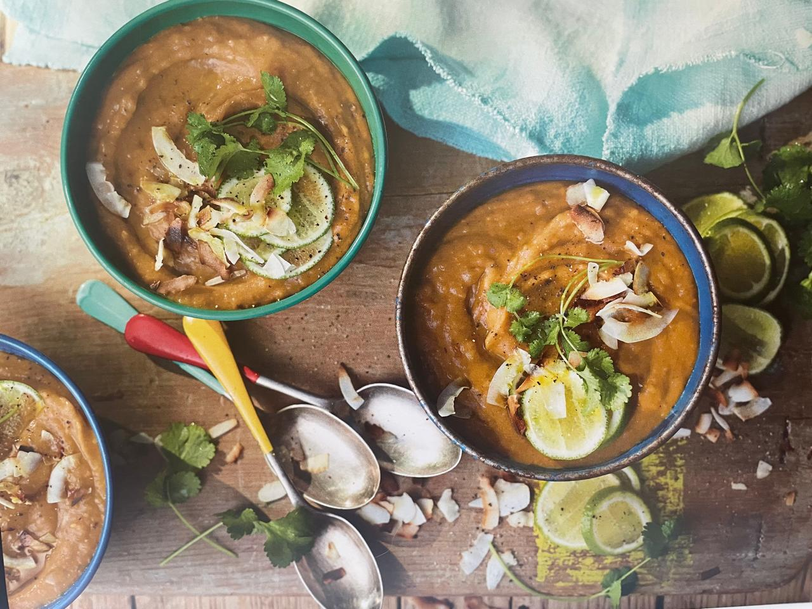

For Renee's birthday party, **Gisele** is preparing a comforting and flavorful dish: **Roasted Sweet Potato & Coconut Soup** from _Ainsley's Caribbean Kitchen_.

This creamy soup highlights the natural sweetness of roasted sweet potatoes, balanced by coconut milk and a hint of spice from curry powder. It's topped with toasted coconut shards and fresh coriander for added texture and flavor.

### What to Expect

- **Key Flavors:** Sweet roasted vegetables, creamy coconut, and warming spices.
- **Perfect Pairing:** Serve as a starter or alongside crusty bread for a complete meal.
- **Difficulty Level:** Easy—an approachable recipe for anyone who loves hearty soups!

Gisele’s dish is sure to add warmth and sweetness to the party. Get ready for a delightful bowl of comfort!