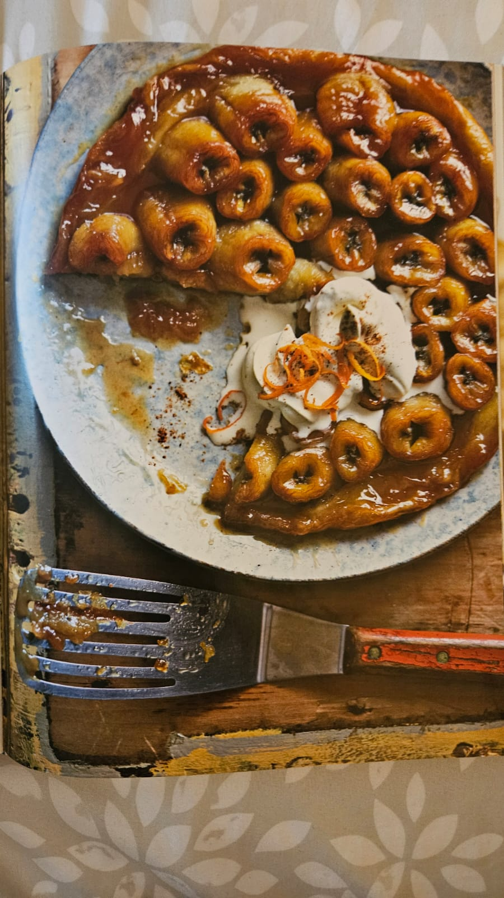

For Renee's birthday party, we are making **Banana Tarte Tatin with Spiced Rum Cream** from _Ainsley's Caribbean Kitchen_.

The rum cream will be on the side for kiddies and non-drinkers :).

This dessert is a tropical twist on a French classic, featuring caramelized bananas nestled in a rich, spiced sauce and baked with flaky puff pastry. It’s served with a dollop of decadent spiced rum cream for a truly indulgent finish.

### What to Expect

- **Key Flavors:** Sweet caramelized bananas, warming spices, and a hint of dark rum.
- **Perfect Pairing:** A creamy, citrusy rum sauce to complement the dessert.
- **Difficulty Level:** Moderate—great for anyone who enjoys baking!

We’re looking forward to sharing this sweet Caribbean treat with everyone at the party!
