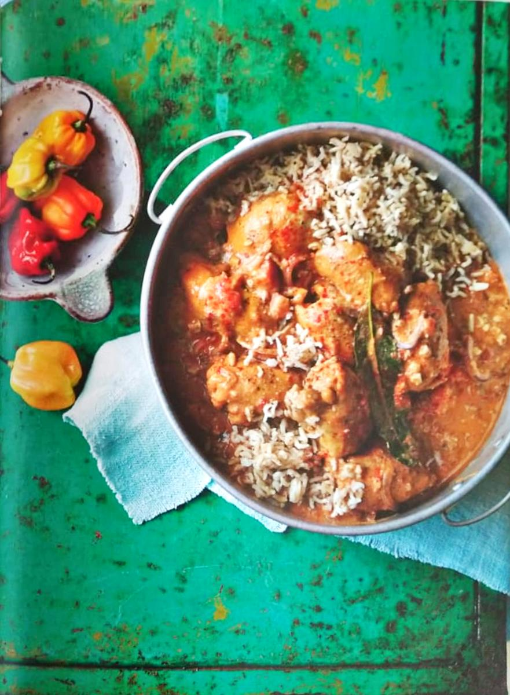

For Renee's birthday party, **JoJo** is preparing a hearty and flavorful main dish: **Dutchie Pot Peanut Butter Chicken Stew** from _Ainsley's Caribbean Kitchen_.

This comforting one-pot meal combines tender chicken with creamy peanut butter, tomatoes, and a medley of Caribbean spices. Served with plain brown rice, it's a dish that’s both satisfying and full of bold, warming flavors.

### What to Expect

- **Key Flavors:** Rich peanut butter, aromatic spices, and tender chicken.
- **Perfect Pairing:** Serve with plain brown rice to soak up the delicious sauce.
- **Difficulty Level:** Moderate—perfect for those who love making flavorful stews.

JoJo’s dish will be a standout at the party, bringing warmth and hearty goodness to the table. Get ready for a feast of comforting Caribbean flavors!
