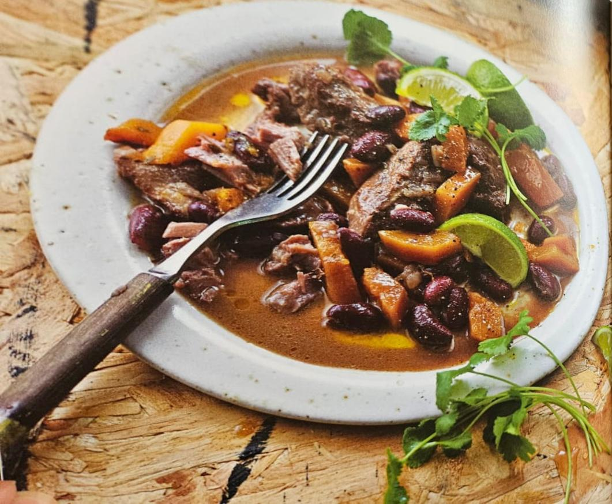

For Renee's birthday party, **Karlene** is preparing a delicious and hearty dish: **Porky Pumpkin & Red Bean Rundown** from _Ainsley's Caribbean Kitchen_.

This aromatic stew combines tender pork, sweet pumpkin, and red beans in a rich coconut milk sauce, flavored with a medley of Caribbean spices like ginger, allspice, and Scotch bonnet chili. Served with steamed rice or roti, this dish is both comforting and packed with vibrant flavors.

### What to Expect

- **Key Flavors:** Sweet and savory pumpkin, tender pork, and warming spices in a creamy coconut base.
- **Perfect Pairing:** Serve with steamed rice or roti to soak up the flavorful sauce.
- **Difficulty Level:** Moderate—a dish for those who love layering bold flavors.

Karlene’s dish will add a burst of Caribbean warmth to the party table, making it an unforgettable part of the celebration. Get ready for a taste of the islands!