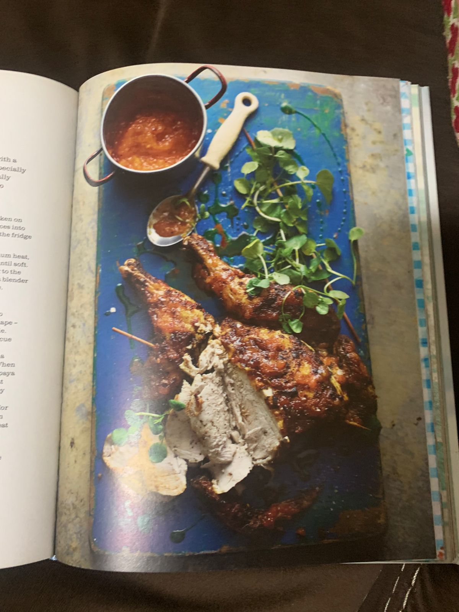

For Renée's birthday party, **Steph and Pete** are bringing the heat with **Spiced Spatchcock Chicken with Papaya Glaze** from _Ainsley's Caribbean Kitchen_.

This dish combines the smoky, crispy flavors of barbecued spatchcock chicken with the sweetness of papaya and a hint of spice, making it a showstopping main course for the party.

### What to Expect

- **Key Flavors:** Smoky grilled chicken, sweet and tangy papaya glaze, with a kick of chili.
- **Perfect Pairing:** A refreshing side salad or roasted vegetables to balance the bold flavors.
- **Difficulty Level:** Moderate—ideal for those who love grilling or roasting!

Steph and Pete’s dish will bring a bold, tropical centerpiece to the party table. Get ready for some seriously flavorful bites!
